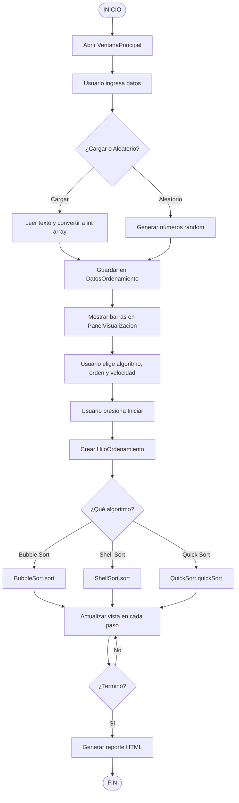
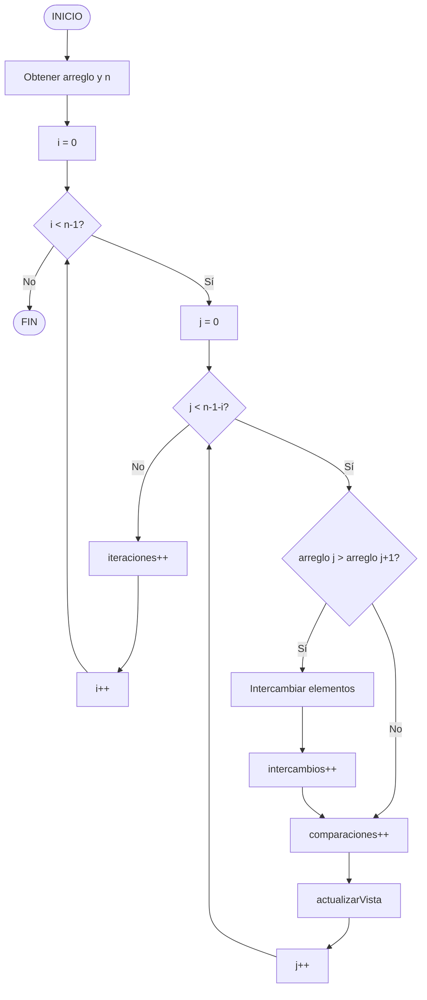
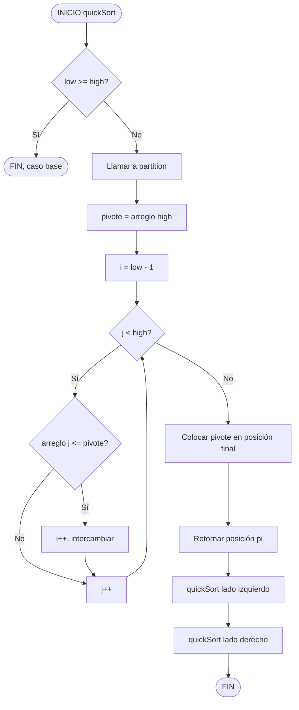

# Diagrama de Flujo - Visualizador de Algoritmos de Ordenamiento

## Flujo Principal de la Aplicación

```mermaid
flowchart TD
    A([INICIO]) --> B[Abrir VentanaPrincipal]
    B --> C[Usuario ingresa datos]
    C --> D{¿Cargar o Aleatorio?}
    D -->|Cargar| E[Leer texto y convertir a int array]
    D -->|Aleatorio| F[Generar números random]
    E --> G[Guardar en DatosOrdenamiento]
    F --> G
    G --> H[Mostrar barras en PanelVisualizacion]
    H --> I[Usuario elige algoritmo, orden y velocidad]
    I --> J[Usuario presiona Iniciar]
    J --> K[Crear HiloOrdenamiento]
    K --> L{¿Qué algoritmo?}
    L -->|Bubble Sort| M[BubbleSort.sort]
    L -->|Shell Sort| N[ShellSort.sort]
    L -->|Quick Sort| O[QuickSort.quickSort]
    M --> P[Actualizar vista en cada paso]
    N --> P
    O --> P
    P --> Q{¿Terminó?}
    Q -->|No| P
    Q -->|Sí| R[Generar reporte HTML]
    R --> S([FIN])
```

## Flujo de Bubble Sort

```mermaid
flowchart TD
    A([INICIO]) --> B[Obtener arreglo y n]
    B --> C[i = 0]
    C --> D{i < n-1?}
    D -->|No| K([FIN])
    D -->|Sí| E[j = 0]
    E --> F{j < n-1-i?}
    F -->|No| I[iteraciones++]
    I --> J[i++]
    J --> D
    F -->|Sí| G{arreglo j > arreglo j+1?}
    G -->|No| H[comparaciones++]
    G -->|Sí| L[Intercambiar elementos]
    L --> M[intercambios++]
    M --> H
    H --> N[actualizarVista]
    N --> O[j++]
    O --> F
```

## Flujo de Quick Sort

```mermaid
flowchart TD
    A([INICIO quickSort]) --> B{low >= high?}
    B -->|Sí| C([FIN, caso base])
    B -->|No| D[Llamar a partition]
    D --> E[pivote = arreglo high]
    E --> F[i = low - 1]
    F --> G{j < high?}
    G -->|No| H[Colocar pivote en posición final]
    H --> I[Retornar posición pi]
    G -->|Sí| J{arreglo j <= pivote?}
    J -->|No| K[j++]
    J -->|Sí| L[i++, intercambiar]
    L --> K
    K --> G
    I --> M[quickSort lado izquierdo]
    M --> N[quickSort lado derecho]
    N --> O([FIN])
```
