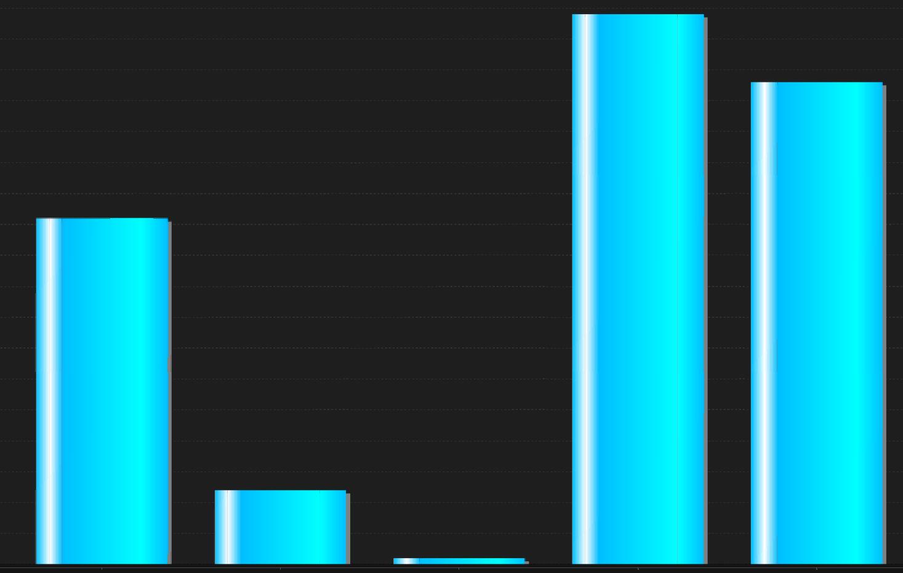
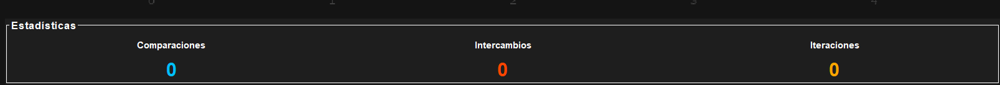

# Manual Técnico - Visualizador de Algoritmos de Ordenamiento

## 1. Descripción General
Aplicación de escritorio desarrollada en Java que permite visualizar 
de forma animada y en tiempo real el funcionamiento de tres algoritmos 
de ordenamiento: Bubble Sort, Shell Sort y Quick Sort.

## 2. Estructura del Proyecto
```
src/
├── algoritmos/
│   ├── BubbleSort.java
│   ├── ShellSort.java
│   └── QuickSort.java
├── modelo/
│   └── DatosOrdenamiento.java
├── vista/
│   ├── VentanaPrincipal.java
│   ├── PanelControl.java
│   ├── PanelVisualizacion.java
│   └── PanelEstadisticas.java
├── hilo/
│   └── HiloOrdenamiento.java
├── reporte/
│   └── GeneradorReporte.java
└── practica2/
    └── Practica2.java
```

## 3. Librerías Utilizadas
- **Java JDK 25** → lenguaje de programación principal
- **Java Swing/AWT** → construcción de la interfaz gráfica
- **JFreeChart 1.0.19** → generación de la gráfica de barras animada
- **JCommon 1.0.23** → dependencia requerida por JFreeChart

## 4. Descripción de Clases

### 4.1 `DatosOrdenamiento.java` (paquete modelo)
Clase modelo que centraliza todos los datos compartidos entre clases.
Almacena el arreglo, estadísticas, configuración y estados de colores.

**Atributos principales:**
- `int[] arreglo` → arreglo que se está ordenando
- `int[] arregloOriginal` → copia del arreglo antes de ordenar
- `int[] colores` → estado visual de cada barra
- `int comparaciones, intercambios, iteraciones` → contadores
- `String algoritmo, orden` → configuración del usuario
- `int velocidad` → delay de animación en milisegundos

### 4.2 `BubbleSort.java` (paquete algoritmos)
Implementación iterativa del algoritmo Bubble Sort con dos bucles 
anidados. Compara elementos vecinos e intercambia si están en orden 
incorrecto. Actualiza contadores y notifica al hilo en cada paso.

**Método principal:**
- `sort(DatosOrdenamiento datos, HiloOrdenamiento hilo)`

### 4.3 `ShellSort.java` (paquete algoritmos)
Implementación iterativa del algoritmo Shell Sort con secuencia de 
gaps. Ordena subconjuntos del arreglo a distancias decrecientes.

**Método principal:**
- `sort(DatosOrdenamiento datos, HiloOrdenamiento hilo)`

### 4.4 `QuickSort.java` (paquete algoritmos)
Implementación **recursiva** del algoritmo Quick Sort. Divide el 
arreglo alrededor de un pivote (último elemento) y se llama 
recursivamente sobre cada mitad.

**Métodos:**
- `quickSort(DatosOrdenamiento datos, int low, int high, HiloOrdenamiento hilo)`
- `partition(DatosOrdenamiento datos, int low, int high, HiloOrdenamiento hilo)`

### 4.5 `HiloOrdenamiento.java` (paquete hilo)
Extiende `Thread`. Corre el algoritmo seleccionado en paralelo con 
la interfaz gráfica. Usa `Thread.sleep()` para controlar la velocidad 
y `SwingUtilities.invokeLater()` para actualizar la UI de forma segura.

**Métodos principales:**
- `run()` → ejecuta el algoritmo seleccionado
- `actualizarVista()` → pausa y notifica a los paneles visuales
- `detener()` → detiene la ejecución

### 4.6 `VentanaPrincipal.java` (paquete vista)
Extiende `JFrame`. Ventana principal que organiza todos los paneles 
usando `BorderLayout`.

### 4.7 `PanelControl.java` (paquete vista)
Extiende `JPanel`. Contiene todos los controles de usuario: campo de 
texto, botones Cargar y Aleatorio, selectores de algoritmo, orden y 
velocidad, y botones Iniciar y Detener.

### 4.8 `PanelVisualizacion.java` (paquete vista)
Extiende `JPanel`. Muestra la gráfica de barras usando JFreeChart. 
Se actualiza dinámicamente en cada paso del algoritmo mediante el 
método `actualizar(DatosOrdenamiento datos)`.

### 4.9 `PanelEstadisticas.java` (paquete vista)
Extiende `JPanel`. Muestra en tiempo real los contadores de 
comparaciones, intercambios e iteraciones mediante `JLabel`.

### 4.10 `GeneradorReporte.java` (paquete reporte)
Genera un archivo `reporte.html` al finalizar cada ejecución con 
toda la información de la corrida.

## 5. Lógica de los Algoritmos

### Bubble Sort
Dos bucles anidados. El externo controla las pasadas (n-1) y el 
interno compara elementos vecinos. En cada comparación si están 
en orden incorrecto se intercambian usando una variable temporal.

### Shell Sort
Tres bucles. El externo reduce el gap (n/2 → n/4 → ... → 1). 
El medio recorre el arreglo con ese gap. El interno compara e 
intercambia elementos separados por el gap.

### Quick Sort
Recursivo. El método `quickSort` llama a `partition` para ubicar 
el pivote y luego se llama a sí mismo para ordenar la mitad 
izquierda y derecha. Caso base: `low >= high`.

## 6. Concurrencia
La animación corre en un hilo separado (`HiloOrdenamiento extends Thread`). 
Las actualizaciones de la UI se realizan mediante 
`SwingUtilities.invokeLater()` para no bloquear el EDT 
(Event Dispatch Thread).

## 7. Restricciones Aplicadas
- Solo arreglos primitivos `int[]`
- Sin uso de `ArrayList`, `LinkedList`, `Vector` o `Stack`
- Sin uso de `Arrays.sort()` o `Collections.sort()`
- Quick Sort implementado con recursión real, no iterativa
- UI construida exclusivamente con Java Swing/AWT

## 8. Capturas de Pantalla

### Ventana Principal


### Visualización durante el ordenamiento


### Panel de Estadísticas

