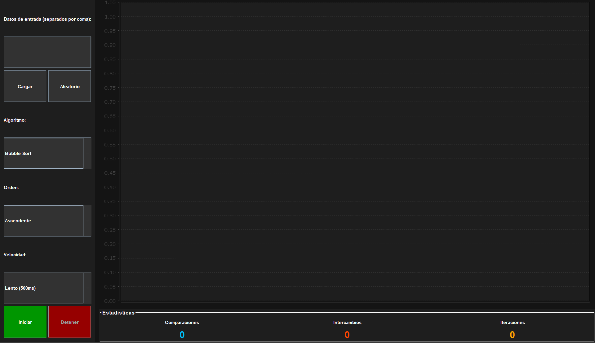
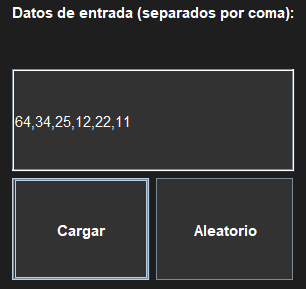
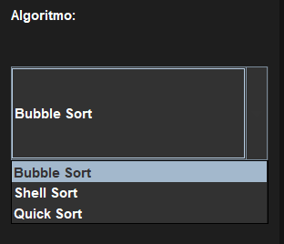
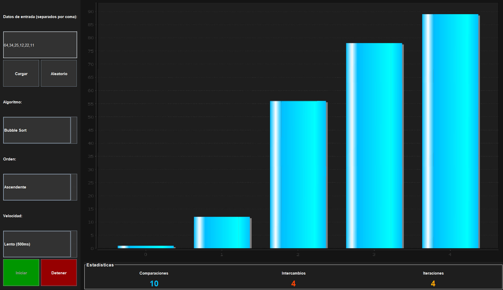
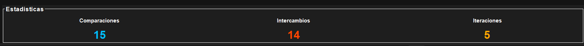
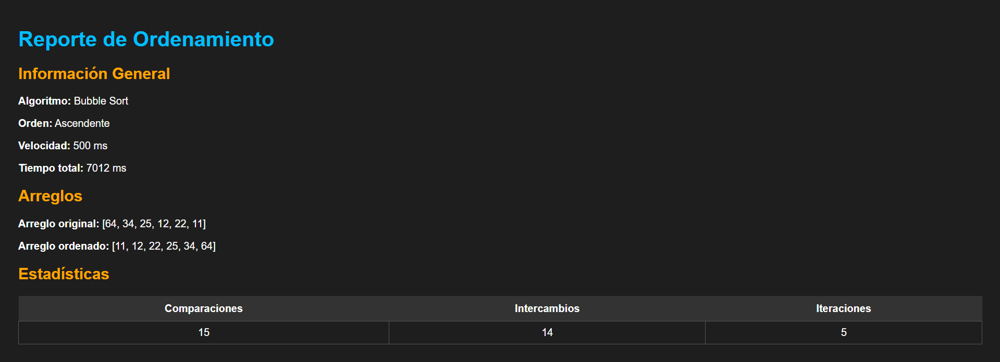

# Manual de Usuario - Visualizador de Algoritmos de Ordenamiento

## 1. Descripción
Aplicación de escritorio que permite visualizar de forma animada 
cómo funcionan los algoritmos de ordenamiento Bubble Sort, 
Shell Sort y Quick Sort.

## 2. Requisitos del Sistema
- Java JDK 11 o superior instalado
- Sistema operativo: Windows, Mac o Linux
- Resolución de pantalla mínima: 1024x768

## 3. ¿Cómo ejecutar la aplicación?
Abrí el proyecto en NetBeans o IntelliJ y presioná el botón 
**Run** o la tecla **F6**.

## 4. Interfaz Principal



La ventana se divide en dos secciones:
- **Panel izquierdo** → controles de la aplicación
- **Panel derecho** → gráfica de barras y estadísticas

## 5. ¿Cómo usar la aplicación?

### Paso 1 — Ingresar datos
Tenés dos formas de ingresar los datos:

**Opción A — Escribir manualmente:**
En el campo de texto escribís los números separados por coma:
```
64, 34, 25, 12, 22, 11
```
Luego presionás el botón **Cargar**.



**Opción B — Generar aleatorio:**
Presionás el botón **Aleatorio** y el programa genera 
automáticamente entre 5 y 30 números aleatorios.

### Paso 2 — Elegir el algoritmo
En el selector **Algoritmo** elegís uno de los tres disponibles:

- **Bubble Sort** → algoritmo iterativo clásico
- **Shell Sort** → algoritmo iterativo con gaps
- **Quick Sort** → algoritmo recursivo



### Paso 3 — Elegir el orden
En el selector **Orden** elegís la dirección del ordenamiento:

- **Ascendente** → de menor a mayor (1, 2, 3...)
- **Descendente** → de mayor a menor (9, 8, 7...)

### Paso 4 — Elegir la velocidad
En el selector **Velocidad** elegís qué tan rápido se ve la animación:

| Velocidad | Delay |
|---|---|
| Lento | 500 ms por paso |
| Medio | 100 ms por paso |
| Rápido | 20 ms por paso |

### Paso 5 — Iniciar el ordenamiento
Presionás el botón verde **Iniciar** y verás cómo las barras 
se van ordenando en tiempo real.



### Paso 6 — Detener el ordenamiento
Si querés parar la animación antes de que termine, presionás 
el botón rojo **Detener**.

## 6. Estadísticas en tiempo real

Durante el ordenamiento podés ver en la parte inferior:

- **Comparaciones** → cuántas veces se compararon dos elementos
- **Intercambios** → cuántas veces se intercambiaron dos elementos
- **Iteraciones** → cuántas pasadas se completaron



## 7. Reporte
Al terminar cada ordenamiento se genera automáticamente un 
archivo **reporte.html** en la carpeta del proyecto con:
- Algoritmo utilizado y dirección del orden
- Arreglo original y arreglo ordenado
- Total de comparaciones, intercambios e iteraciones
- Tiempo total de ejecución

Para verlo abrís la carpeta del proyecto y hacés doble clic 
en **reporte.html**.



## 9. Errores comunes

**"Por favor ingresá los datos"**
→ Presionaste Iniciar sin cargar datos primero. Ingresá números y presioná Cargar.

**"Solo se permiten números enteros separados por coma"**
→ Escribiste letras o símbolos incorrectos. Solo ingresá números separados por coma.
